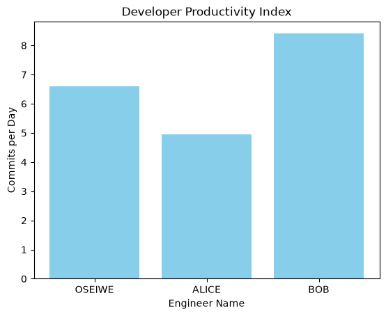

# Automated Data Infrastructure & Engineering Pipeline

## 🏢 Business Case & Project Overview
This production pipeline was engineered to ingest, clean, and merge fragmented infrastructure and performance data assets across our systems engineering team. By resolving text styling anomalies and joining independent data vectors, the system automatically surfaces a unified developer productivity metric.

## 🛠️ Technical Toolkit Used
* **Language:** Python
* **Data Manipulation:** Pandas (Method Chaining, Key Joins, Feature Engineering)
* **Data Visualization:** Matplotlib Pyplot
* **Database Management:** MySQL (Relational Aggregations)

## 📊 Pipeline Transformation Results
The automated script successfully normalizes names, calculates performance index velocities, and generates a clean visualization asset:

### 📈 Key Engineering Takeaways from the Data:
* **Top Performer:** BOB achieved the highest production index of **8.40** commits per active day ($210 \div 25$).
* **Runner-Up:** OSEIWE achieved a highly competitive velocity of **6.59** commits per active day ($145 \div 22$).
* **Pipeline Speed:** Data extraction, joins, and visual file exports happen instantly in memory, removing manual Excel overhead for management reporting.
